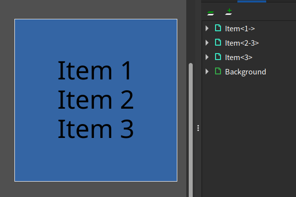

# inkscape-slide

Generate slides from inkscape svg with LaTeX beamer overlay syntax.

## Usage

- Create SVG with Inkscape
- Append beamer overlay syntax to layer label
- Only available for **top level** layers

```
python3 inkscape-slide.py ./sample.svg
```

## Example




## Syntax

```
<1>
item<1>
item<1,2>
item<1,2,3>
item<1-3>
item<1->
item<-3>
```
